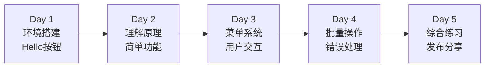

# 📚 MN Toolbar 插件开发培训教程

> 🎯 **课程目标**：零基础学员在 3 小时内掌握 MN Toolbar 插件开发，能独立创建实用功能

## 课程大纲

| 模块 | 时长 | 内容 | 实践 |
|------|------|------|------|
| 模块一 | 30分钟 | 认识 MN Toolbar | 环境搭建 |
| 模块二 | 45分钟 | 第一个按钮 | Hello MN |
| 模块三 | 45分钟 | 理解工作原理 | 调试练习 |
| 模块四 | 60分钟 | 实战功能开发 | 3个实用功能 |
| 模块五 | 30分钟 | 进阶与扩展 | 综合练习 |

---

## 📖 模块一：认识 MN Toolbar（30分钟）

### 学习目标
- ✅ 理解什么是 MN Toolbar 插件
- ✅ 了解插件能做什么
- ✅ 搭建开发环境

### 1.1 插件是什么？

> 💡 **生活类比**：插件就像给手机装 APP，给 MarginNote 增加新功能

想象一下：
- **MarginNote** = 智能手机
- **MN Toolbar** = 一个超级 APP
- **你的代码** = APP 里的新功能

MN Toolbar 让你能在 MarginNote 里添加自定义按钮，每个按钮可以执行特定功能，比如：
- 🕐 一键添加时间戳
- 🏷️ 批量添加标签
- 📝 快速制作卡片
- 🎨 自动格式化

### 1.2 看看最终效果

在开始之前，让我们看看你能做出什么：

```
MarginNote 界面
├── 你的笔记本
├── 文档
└── 工具栏 ← 这里就是 MN Toolbar！
    ├── [时间戳] 按钮  ← 你创建的
    ├── [批量标签] 按钮 ← 你创建的
    └── [更多...] 按钮  ← 你创建的
```

点击按钮后：
- 立即执行功能
- 或显示菜单选项
- 或弹出输入框

### 1.3 开发环境准备

#### 📁 找到插件文件夹

**macOS 路径**：
```bash
~/Library/Containers/QReader.MarginStudyMac/Data/Library/MarginNote Extensions/mntoolbar
```

**快速打开方法**：
1. 打开 Finder
2. 按 `Cmd + Shift + G`
3. 粘贴上面的路径

#### 🛠️ 准备工具

你只需要：
- 📝 文本编辑器（推荐 VSCode）
- 🖼️ 图标文件（40×40 像素 PNG）
- 📱 MarginNote 3

#### 📂 认识文件结构

```
mntoolbar/
├── 📜 main.js                    # 大门（不用改）
├── 📜 utils.js                   # 工具箱（不用改）
├── 📜 webviewController.js       # 控制中心（不用改）
├── 📜 settingController.js       # 设置界面（不用改）
│
└── 🎯 你要修改的文件：
    ├── xdyy_button_registry.js    # 定义按钮
    ├── xdyy_menu_registry.js      # 定义菜单
    └── xdyy_custom_actions_registry.js # 定义功能
```

> ⚠️ **重要提醒**：永远不要修改前4个文件，只修改 `xdyy_` 开头的文件！

### 🎯 动手练习 1：确认环境

1. 找到并打开 mntoolbar 文件夹
2. 确认能看到上述文件
3. 用编辑器打开 `xdyy_button_registry.js`
4. 找到第 47-51 行，看到类似这样的代码：
   ```javascript
   global.registerButton("custom15", {
     name: "制卡",
     image: "makeCards",
     templateName: "menu_makeCards"
   });
   ```

✅ 如果能看到这些，环境就准备好了！

---

## 🚀 模块二：第一个按钮（45分钟）

### 学习目标
- ✅ 创建第一个"Hello MN"按钮
- ✅ 理解按钮三要素
- ✅ 看到按钮出现在工具栏

### 2.1 按钮三要素

> 💡 **餐厅类比**：创建按钮就像在餐厅点菜

| 要素 | 餐厅类比 | 代码位置 |
|------|----------|----------|
| **按钮** | 菜单上的菜名 | xdyy_button_registry.js |
| **菜单** | 这道菜怎么做 | xdyy_menu_registry.js |
| **动作** | 厨师做菜 | xdyy_custom_actions_registry.js |

### 2.2 创建 Hello MN 按钮

#### 步骤 1：注册按钮（告诉系统有这个按钮）

打开 `xdyy_button_registry.js`，在 `registerAllButtons()` 函数的末尾（大约第 144 行，`custom19` 之前）添加：

```javascript
// 我的第一个按钮！
global.registerButton("custom16", {
  name: "Hello",           // 按钮显示的文字
  image: "custom16",       // 使用 custom16.png 图标
  templateName: "menu_hello"  // 关联的菜单模板
});
```

#### 步骤 2：定义菜单（按钮被点击时做什么）

打开 `xdyy_menu_registry.js`，在文件末尾添加：

```javascript
// Hello 按钮的菜单配置
global.registerMenuTemplate("menu_hello", {
  action: "sayHello"  // 执行 sayHello 动作
});
```

#### 步骤 3：实现功能（具体做什么）

打开 `xdyy_custom_actions_registry.js`，在文件末尾添加：

```javascript
// Hello 功能的实现
global.registerCustomAction("sayHello", async function(context) {
  // MNUtil.showHUD 会在屏幕上显示提示
  MNUtil.showHUD("🎉 Hello MN Toolbar!");
  
  // 获取当前选中的卡片
  const focusNote = MNNote.getFocusNote();
  
  if (focusNote) {
    // 如果有选中的卡片，显示它的标题
    MNUtil.showHUD("卡片标题: " + (focusNote.noteTitle || "无标题"));
  } else {
    // 没有选中卡片
    MNUtil.showHUD("请先选择一个卡片");
  }
});
```

### 2.3 测试你的按钮

1. **保存所有文件**
2. **完全退出 MarginNote**（Cmd+Q）
3. **重新打开 MarginNote**
4. **打开工具栏设置**：
   - 点击工具栏的设置按钮
   - 找到"Hello"按钮
   - 将它拖到工具栏
5. **点击 Hello 按钮**
6. **看到 "🎉 Hello MN Toolbar!" 提示**

> 🎉 **恭喜！你创建了第一个功能！**

### 2.4 理解代码流程

```
用户点击 Hello 按钮
    ↓
系统查找 custom16 的配置（xdyy_button_registry.js）
    ↓
找到 templateName: "menu_hello"
    ↓
查找 menu_hello 模板（xdyy_menu_registry.js）
    ↓
找到 action: "sayHello"
    ↓
执行 sayHello 函数（xdyy_custom_actions_registry.js）
    ↓
显示 "Hello MN Toolbar!"
```

### 🎯 动手练习 2：修改功能

修改 `sayHello` 函数，让它：
1. 显示当前时间
2. 如果有选中的卡片，在标题后加上时间

**提示代码**：
```javascript
global.registerCustomAction("sayHello", async function(context) {
  // 获取当前时间
  const now = new Date().toLocaleString('zh-CN');
  MNUtil.showHUD("现在时间: " + now);
  
  // 获取选中的卡片
  const focusNote = MNNote.getFocusNote();
  if (focusNote) {
    // 使用撤销分组，这样用户可以撤销
    MNUtil.undoGrouping(() => {
      focusNote.noteTitle = (focusNote.noteTitle || "") + " [" + now + "]";
      MNUtil.showHUD("✅ 已添加时间戳");
    });
  }
});
```

---

## 🔍 模块三：理解工作原理（45分钟）

### 学习目标
- ✅ 理解按钮点击的完整流程
- ✅ 学会调试和排错
- ✅ 掌握常用 API

### 3.1 工作原理详解

> 💡 **快递类比**：按钮点击就像寄快递

```
发件（用户点击）
    ↓
快递公司查单（查找按钮配置）
    ↓
分拣中心（获取菜单模板）
    ↓
派送（找到对应动作）
    ↓
签收（执行功能）
```

### 3.2 核心概念

#### Context 对象（执行环境）

每个动作函数都会收到一个 `context` 对象，包含：

```javascript
context = {
  button: button,           // 被点击的按钮
  des: des,                // 动作描述
  focusNote: focusNote,    // 当前选中的卡片
  focusNotes: focusNotes,  // 所有选中的卡片
  self: controller         // 控制器对象
}
```

**实际使用**：
```javascript
global.registerCustomAction("myAction", async function(context) {
  // 解构获取需要的对象
  const { focusNote, focusNotes } = context;
  
  if (focusNote) {
    // 处理单个卡片
    MNUtil.showHUD("处理卡片: " + focusNote.noteTitle);
  }
  
  if (focusNotes && focusNotes.length > 1) {
    // 处理多个卡片
    MNUtil.showHUD(`选中了 ${focusNotes.length} 个卡片`);
  }
});
```

### 3.3 调试技巧

#### 1. 使用日志输出

```javascript
// 在你的代码中添加日志
MNUtil.log("🔍 调试: 进入 sayHello 函数");
MNUtil.log("📦 focusNote: " + focusNote);
MNUtil.log("✅ 执行成功");
```

#### 2. 显示对象内容

```javascript
// 复制对象到剪贴板查看
MNUtil.copyJSON(focusNote);
MNUtil.showHUD("对象已复制到剪贴板");
```

#### 3. 错误处理

```javascript
global.registerCustomAction("safeAction", async function(context) {
  try {
    // 你的代码
    const focusNote = MNNote.getFocusNote();
    if (!focusNote) {
      throw new Error("没有选中卡片");
    }
    
    // 处理逻辑
    focusNote.noteTitle = "已处理";
    MNUtil.showHUD("✅ 成功");
    
  } catch (error) {
    // 显示错误
    MNUtil.showHUD("❌ 错误: " + error.message);
    MNUtil.log("错误详情: " + error);
  }
});
```

### 3.4 常见问题排查

| 问题 | 原因 | 解决方法 |
|------|------|----------|
| 按钮不显示 | 没有重启 MN | 完全退出后重启 |
| 点击没反应 | action 名称不匹配 | 检查三个文件中的名称是否一致 |
| 显示 "Not supported" | 动作未注册 | 确认在 xdyy_custom_actions_registry.js 中注册了 |
| 功能报错 | 代码有语法错误 | 查看日志，修正错误 |

### 🎯 动手练习 3：添加调试信息

在你的 `sayHello` 函数中添加调试日志：

```javascript
global.registerCustomAction("sayHello", async function(context) {
  MNUtil.log("🚀 开始执行 sayHello");
  
  const { focusNote, focusNotes } = context;
  MNUtil.log(`📦 选中卡片数: ${focusNotes ? focusNotes.length : 0}`);
  
  try {
    if (focusNote) {
      MNUtil.log("✅ 找到焦点卡片: " + focusNote.noteId);
      // 你的处理逻辑
    } else {
      MNUtil.log("⚠️ 没有选中卡片");
    }
  } catch (error) {
    MNUtil.log("❌ 错误: " + error);
  }
  
  MNUtil.log("🏁 sayHello 执行完成");
});
```

---

## 💼 模块四：实战功能开发（60分钟）

### 学习目标
- ✅ 开发 3 个实用功能
- ✅ 学会菜单系统
- ✅ 掌握用户交互

### 4.1 功能一：智能时间戳

> 需求：点击添加时间戳，长按显示更多选项

#### 完整实现

**步骤 1：注册按钮**（xdyy_button_registry.js）
```javascript
global.registerButton("custom17", {
  name: "时间戳",
  image: "custom17",
  templateName: "menu_timestamp"
});
```

**步骤 2：定义菜单**（xdyy_menu_registry.js）
```javascript
global.registerMenuTemplate("menu_timestamp", {
  action: "addTimestamp",      // 默认：点击动作
  onLongPress: {               // 长按：显示菜单
    action: "menu",
    menuWidth: 200,
    menuItems: [
      {
        action: "addTimestamp",
        menuTitle: "添加到标题"
      },
      {
        action: "addTimestampComment",
        menuTitle: "添加为评论"
      },
      {
        action: "copyTimestamp",
        menuTitle: "复制时间戳"
      }
    ]
  }
});
```

**步骤 3：实现功能**（xdyy_custom_actions_registry.js）
```javascript
// 添加到标题
global.registerCustomAction("addTimestamp", async function(context) {
  const focusNote = MNNote.getFocusNote();
  
  if (!focusNote) {
    MNUtil.showHUD("❌ 请先选择卡片");
    return;
  }
  
  MNUtil.undoGrouping(() => {
    const timestamp = new Date().toLocaleString('zh-CN');
    
    if (focusNote.noteTitle) {
      focusNote.noteTitle = `${focusNote.noteTitle} [${timestamp}]`;
    } else {
      focusNote.noteTitle = timestamp;
    }
    
    MNUtil.showHUD("✅ 时间戳已添加");
  });
});

// 添加为评论
global.registerCustomAction("addTimestampComment", async function(context) {
  const focusNote = MNNote.getFocusNote();
  
  if (!focusNote) {
    MNUtil.showHUD("❌ 请先选择卡片");
    return;
  }
  
  MNUtil.undoGrouping(() => {
    const timestamp = new Date().toLocaleString('zh-CN');
    focusNote.appendComment(`📅 ${timestamp}`);
    MNUtil.showHUD("✅ 时间戳已添加为评论");
  });
});

// 复制时间戳
global.registerCustomAction("copyTimestamp", async function(context) {
  const timestamp = new Date().toLocaleString('zh-CN');
  MNUtil.copy(timestamp);
  MNUtil.showHUD(`✅ 已复制: ${timestamp}`);
});
```

### 4.2 功能二：批量标签

> 需求：为选中的多个卡片批量添加标签

**完整实现**（xdyy_custom_actions_registry.js）：
```javascript
// 批量添加标签
global.registerCustomAction("batchAddTag", async function(context) {
  const focusNotes = MNNote.getFocusNotes();
  
  if (!focusNotes || focusNotes.length === 0) {
    MNUtil.showHUD("❌ 请先选择卡片");
    return;
  }
  
  // 显示输入框
  UIAlertView.showWithTitleMessageStyleCancelButtonTitleOtherButtonTitlesTapBlock(
    "批量添加标签",
    `将为 ${focusNotes.length} 个卡片添加标签`,
    2,  // 输入框样式
    "取消",
    ["添加"],
    (alert, buttonIndex) => {
      if (buttonIndex === 1) {
        const tagName = alert.textFieldAtIndex(0).text;
        
        if (tagName && tagName.trim()) {
          MNUtil.undoGrouping(() => {
            let count = 0;
            
            focusNotes.forEach(note => {
              if (!note.tags.includes(tagName)) {
                note.appendTags([tagName.trim()]);
                count++;
              }
            });
            
            MNUtil.showHUD(`✅ 已为 ${count} 个卡片添加标签 #${tagName}`);
          });
        } else {
          MNUtil.showHUD("❌ 标签名不能为空");
        }
      }
    }
  );
});
```

### 4.3 功能三：快速模板

> 需求：点击应用预设模板，为卡片设置统一格式

**步骤 1：定义模板菜单**（xdyy_menu_registry.js）
```javascript
global.registerMenuTemplate("menu_template", {
  action: "menu",
  menuWidth: 250,
  menuItems: [
    {
      action: "applyAcademicTemplate",
      menuTitle: "📚 学术笔记"
    },
    {
      action: "applyMeetingTemplate",
      menuTitle: "💼 会议记录"
    },
    {
      action: "applyIdeaTemplate",
      menuTitle: "💡 灵感速记"
    }
  ]
});
```

**步骤 2：实现模板功能**（xdyy_custom_actions_registry.js）
```javascript
// 学术笔记模板
global.registerCustomAction("applyAcademicTemplate", async function(context) {
  const focusNote = MNNote.getFocusNote();
  
  if (!focusNote) {
    MNUtil.showHUD("❌ 请先选择卡片");
    return;
  }
  
  MNUtil.undoGrouping(() => {
    // 添加前缀
    if (!focusNote.noteTitle) {
      focusNote.noteTitle = "【学术】";
    } else if (!focusNote.noteTitle.startsWith("【学术】")) {
      focusNote.noteTitle = "【学术】" + focusNote.noteTitle;
    }
    
    // 设置颜色（黄色）
    focusNote.colorIndex = 3;
    
    // 添加标签
    focusNote.appendTags(["学术", "待整理"]);
    
    // 添加时间戳评论
    const timestamp = new Date().toLocaleString('zh-CN');
    focusNote.appendComment(`📚 学术笔记 - ${timestamp}`);
    
    MNUtil.showHUD("✅ 已应用学术笔记模板");
  });
});
```

### 🎯 动手练习 4：创建自己的功能

基于上面的例子，创建一个"清理格式"功能：
1. 清除卡片的所有格式
2. 统一设置为指定颜色
3. 删除所有标签

提示：使用 `focusNote.clearFormat()` 和 `focusNote.tags = []`

---

## 🚀 模块五：进阶与扩展（30分钟）

### 学习目标
- ✅ 掌握多级菜单
- ✅ 优化用户体验
- ✅ 发布和分享

### 5.1 多级菜单设计

创建复杂的菜单结构：

```javascript
// xdyy_menu_registry.js
global.registerMenuTemplate("menu_advanced", {
  action: "menu",
  menuWidth: 300,
  menuItems: [
    "⬇️ 基础操作",  // 分组标题
    {
      action: "basicAction1",
      menuTitle: "    操作1"  // 4个空格缩进
    },
    {
      action: "basicAction2",
      menuTitle: "    操作2"
    },
    
    "⬇️ 高级功能",
    {
      action: "menu",  // 子菜单
      menuTitle: "    更多选项 ➡️",
      menuItems: [
        {
          action: "subAction1",
          menuTitle: "子功能1"
        },
        {
          action: "subAction2",
          menuTitle: "子功能2"
        }
      ]
    }
  ]
});
```

### 5.2 最佳实践总结

#### 1. 始终使用撤销分组
```javascript
MNUtil.undoGrouping(() => {
  // 所有修改操作
});
```

#### 2. 提供清晰的用户反馈
```javascript
MNUtil.showHUD("⏳ 处理中...");  // 开始
MNUtil.showHUD("✅ 成功");        // 成功
MNUtil.showHUD("❌ 失败: " + error.message);  // 失败
```

#### 3. 处理边界情况
```javascript
if (!focusNote) {
  MNUtil.showHUD("❌ 请先选择卡片");
  return;
}
```

#### 4. 性能优化
```javascript
// 批量操作时显示进度
focusNotes.forEach((note, index) => {
  // 处理
  if (index % 10 === 0) {
    const progress = Math.round((index / focusNotes.length) * 100);
    MNUtil.showHUD(`⏳ 进度: ${progress}%`);
  }
});
```

### 5.3 常用 API 速查

#### 卡片操作
```javascript
// 获取
MNNote.getFocusNote()          // 当前卡片
MNNote.getFocusNotes()         // 所有选中

// 属性
note.noteTitle                 // 标题
note.excerptText              // 摘录
note.comments                 // 评论数组
note.tags                     // 标签数组
note.colorIndex               // 颜色 (0-15)

// 方法
note.appendComment(text)       // 添加评论
note.appendTags([tags])        // 添加标签
note.clearFormat()            // 清除格式
```

#### 工具方法
```javascript
MNUtil.showHUD(message)        // 显示提示
MNUtil.copy(text)             // 复制文本
MNUtil.undoGrouping(() => {}) // 撤销分组
MNUtil.delay(seconds)         // 延迟
MNUtil.log(message)           // 输出日志
```

### 🎯 综合练习：制作你的工具集

创建一个包含以下功能的工具集按钮：
1. 快速格式化（清除格式 + 设置颜色）
2. 批量处理（为所有子卡片添加标签）
3. 导出信息（复制所有卡片标题到剪贴板）

---

## 📚 附录A：学习路径图

### 5天学习计划



### 技能检查清单

- [ ] **基础技能**
  - [ ] 能找到并打开插件文件夹
  - [ ] 能创建并显示自定义按钮
  - [ ] 能实现点击执行功能

- [ ] **进阶技能**
  - [ ] 能创建多级菜单
  - [ ] 能处理用户输入
  - [ ] 能批量操作卡片

- [ ] **高级技能**
  - [ ] 能处理错误和异常
  - [ ] 能优化性能
  - [ ] 能调试和排错

---

## 📚 附录B：常见问题 FAQ

### Q1: 按钮不显示怎么办？

**检查步骤**：
1. 确认文件保存了
2. 完全退出 MarginNote（Cmd+Q）
3. 重新打开
4. 检查代码中的按钮名称是否正确

### Q2: 点击按钮没反应？

**可能原因**：
- action 名称不匹配
- 函数有语法错误
- 没有注册动作

**解决方法**：
```javascript
// 添加日志调试
MNUtil.log("按钮被点击");
MNUtil.showHUD("测试");
```

### Q3: 如何查看日志？

**macOS Console 查看方法**：
1. 打开"控制台"应用
2. 搜索 "MarginNote"
3. 查看相关日志

### Q4: 代码报错怎么办？

**调试技巧**：
```javascript
try {
  // 你的代码
} catch (error) {
  MNUtil.showHUD("错误: " + error.message);
  MNUtil.log("详细错误: " + error);
}
```

### Q5: 如何分享我的功能？

1. 整理你的代码
2. 添加注释说明
3. 导出 xdyy_*.js 文件
4. 分享给其他用户

---

## 📚 附录C：代码模板库

### 模板1：基础按钮

```javascript
// === 按钮注册 ===
global.registerButton("customXX", {
  name: "功能名",
  image: "customXX",
  templateName: "menu_function"
});

// === 菜单定义 ===
global.registerMenuTemplate("menu_function", {
  action: "functionAction"
});

// === 功能实现 ===
global.registerCustomAction("functionAction", async function(context) {
  const focusNote = MNNote.getFocusNote();
  
  if (!focusNote) {
    MNUtil.showHUD("❌ 请先选择卡片");
    return;
  }
  
  MNUtil.undoGrouping(() => {
    // 你的功能代码
    MNUtil.showHUD("✅ 完成");
  });
});
```

### 模板2：带菜单的按钮

```javascript
// === 菜单定义 ===
global.registerMenuTemplate("menu_complex", {
  action: "defaultAction",
  onLongPress: {
    action: "menu",
    menuWidth: 200,
    menuItems: [
      {action: "option1", menuTitle: "选项1"},
      {action: "option2", menuTitle: "选项2"}
    ]
  }
});
```

### 模板3：用户输入

```javascript
global.registerCustomAction("userInput", async function(context) {
  UIAlertView.showWithTitleMessageStyleCancelButtonTitleOtherButtonTitlesTapBlock(
    "标题",
    "提示信息",
    2,  // 输入框
    "取消",
    ["确定"],
    (alert, buttonIndex) => {
      if (buttonIndex === 1) {
        const input = alert.textFieldAtIndex(0).text;
        // 处理输入
      }
    }
  );
});
```

### 模板4：批量处理

```javascript
global.registerCustomAction("batchProcess", async function(context) {
  const focusNotes = MNNote.getFocusNotes();
  
  if (!focusNotes || focusNotes.length === 0) {
    MNUtil.showHUD("❌ 请选择卡片");
    return;
  }
  
  MNUtil.undoGrouping(() => {
    let count = 0;
    
    focusNotes.forEach(note => {
      // 处理每个卡片
      count++;
    });
    
    MNUtil.showHUD(`✅ 处理了 ${count} 个卡片`);
  });
});
```

---

## 🎓 结语

恭喜你完成了 MN Toolbar 插件开发培训！

你已经学会了：
- ✅ 创建自定义按钮
- ✅ 实现实用功能
- ✅ 处理用户交互
- ✅ 调试和优化

### 下一步

1. **练习**：基于模板创建更多功能
2. **探索**：查看 utils.js 中的更多 API
3. **分享**：将你的功能分享给社区
4. **进阶**：学习更复杂的功能实现

### 获取帮助

- 📖 查看本教程
- 💬 加入 MN 用户社区
- 🔍 搜索已有的解决方案
- ❓ 提问时附上代码和错误信息

**记住**：编程是一个渐进的过程，每天进步一点点！

---

*本教程基于 MN Toolbar 实际源码编写，所有示例均可直接运行。*

*版本：2024.12 | 作者：MN Toolbar 开发团队*